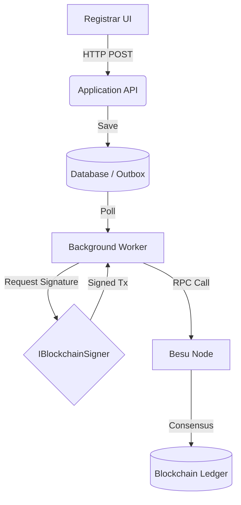
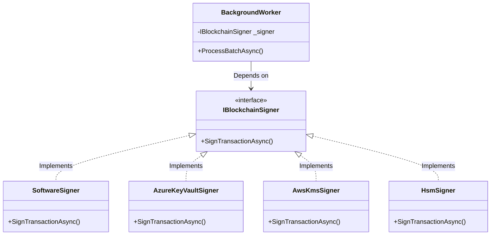

# ADR 002: Blockchain Transaction Signing Architecture

## Status
**Approved**

## Context
ChainDegree is an enterprise blockchain system built using:
- Clean Architecture
- Domain-Driven Design (DDD)
- CQRS
- Outbox Pattern
- Background Workers
- Hyperledger Besu
- Nethereum
- Merkle Tree batching
- Multi-tenant architecture

All blockchain transactions (Issue / Update / Revoke) are executed asynchronously by backend workers. There is no direct user interaction with the blockchain.

## Problem
Currently, many blockchain tutorials and basic implementations rely on browser wallets like MetaMask for transaction signing. However, this approach is entirely unsuitable for an enterprise backend system where transactions must be executed automatically, in batches, and without interactive user approval. The system needs a secure, scalable, and automated way to sign transactions before sending them to the Hyperledger Besu network.

## Decision
The system SHALL NOT depend on MetaMask or any browser wallet.

Instead, blockchain transactions shall be signed by a dedicated backend signing service. We will introduce an abstraction:

```csharp
public interface IBlockchainSigner
{
    Task<string> SignTransactionAsync(TransactionRequest request, CancellationToken cancellationToken);
}
```

The Background Worker only depends on this abstraction.

Possible implementations include:
- `SoftwareSigner` (Development only)
- `AzureKeyVaultSigner`
- `AwsKmsSigner`
- `HashiCorpVaultSigner`
- `HsmSigner`

The blockchain worker requests a signature from the signer abstraction. The signer is responsible for:
- Loading the private key
- Protecting the key
- Signing the transaction
- Returning the signed transaction payload

The worker never knows where the key is stored or how the signing cryptographically happens.

## Motivation
MetaMask is NOT appropriate for enterprise backend workers because:
- **MetaMask is a browser wallet:** Designed for human interaction, not server-to-server communication.
- **Workers execute automatically:** Backend background services run unattended.
- **No interactive user approval exists:** Waiting for a popup confirmation would break automated batch processing.
- **Enterprise systems require unattended transaction execution:** To process thousands of degrees reliably.
- **Separation of concerns:** Key management and signing should be completely separated from business logic orchestration.
- **Infrastructure abstraction:** By hiding the signing mechanism, the system can seamlessly upgrade from software keys to Hardware Security Modules (HSMs) without changing the core application.
- **Security:** In enterprise environments, private keys cannot sit in a plain text `.env` file indefinitely; they must be managed by enterprise vaults.

## Security Considerations
Best practices for the signing architecture:
- Private keys must **never** be stored in plaintext.
- Keys should be encrypted at rest.
- Production environments should use KMS (Key Management Service) or HSM (Hardware Security Module).
- `SoftwareSigner` (reading from config/env) is **only acceptable** for local development environments.
- Support key rotation.
- Audit signing operations (log when a key is used to sign, without exposing the key itself).
- Principle of least privilege: The signing service only has permission to sign specific payload types.

## DDD & Clean Architecture Impact
`IBlockchainSigner` belongs to the **Infrastructure** boundary.

- **Application** depends only on the abstraction (`IBlockchainSigner`).
- **Workers** orchestrate the flow (e.g., getting data, calling the signer, calling Besu).
- Signing is an Infrastructure concern (cryptography, key storage, network to HSM) rather than a Domain concern.

**Dependency Direction:**
`Domain` <-- `Application` <-- `Infrastructure` (where implementations of `IBlockchainSigner` reside).

## Multi-tenant Considerations
In a multi-tenant system:
- Each tenant (Institution) may own an independent blockchain identity (wallet/private key) to guarantee data origin authenticity on the blockchain.
- The `IBlockchainSigner` will perform key lookup by `TenantId` or `InstitutionId`.
- The signer selects the appropriate key internally.
- The Worker remains tenant-agnostic; it simply passes the `InstitutionId` to the signer.
- The signer encapsulates tenant-specific key resolution (e.g., fetching a specific Azure Key Vault secret named `Institution-{Id}-Key`).

## Future Extensibility
The abstraction allows future migration to:
- Azure Key Vault
- AWS KMS
- HashiCorp Vault
- Hardware Security Module (HSM)
- CloudHSM
- Remote signing service

...without changing a single line of Application or Worker code.

## Architecture Diagram

### 1. Current Architecture Flow


### 2. Dependency Diagram


## Acceptance Criteria
- Backend workers never directly manage private keys in memory for more than the scope of the signing request (if using software signer), and preferably not at all (if using HSM/Vault).
- Worker depends only on `IBlockchainSigner`.
- MetaMask is not required or referenced in backend logic.
- Private keys remain protected according to environment standards.
- Signing implementation is replaceable via Dependency Injection.
- The system supports enterprise-grade key management.
- Multi-tenant key resolution is supported.
- Future signer implementations require no changes to the Application Layer.
