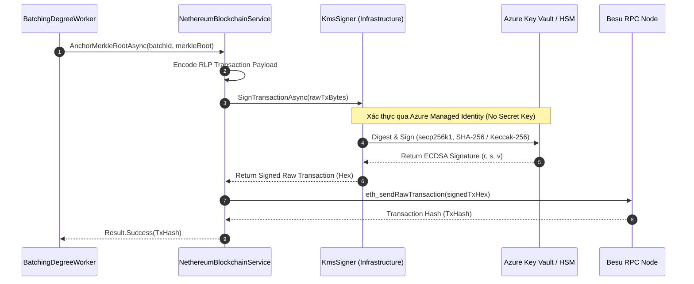

# Kiến trúc Nâng cấp KMS Signer (KMS Signer Architecture)

Tài liệu này đặc tả thiết kế kiến trúc nâng cấp cho dịch vụ ký giao dịch blockchain (`IBlockchainSigner`) từ môi trường phát triển (`LocalEnvSigner`) lên môi trường Cloud/Enterprise production sử dụng Hệ thống quản lý khóa tập trung (Key Management Service - KMS).

---

## 1. Tổng quan & Bối cảnh

Trong giai đoạn MVP và môi trường Dev/Local (Phase 0 - Phase 2), hệ thống ChainDegree sử dụng `LocalEnvSigner` để đọc Private Key trực tiếp từ biến môi trường (`.env`). Phương pháp này đơn giản, nhanh chóng nhưng tồn tại rủi ro bảo mật lớn nếu đưa lên Production:

*   **Rủi ro lộ lọt khóa**: Private Key lưu dưới dạng plaintext trong biến môi trường hoặc bộ nhớ server.
*   **Thiếu Audit Log**: Không kiểm soát và truy vết được ai/khi nào thực hiện thao tác ký.
*   **Khó tuân thủ quy chuẩn Enterprise**: Các tiêu chuẩn như ISO 27001, SOC2 yêu cầu Private Key phải được bảo vệ bằng phần cứng chuyên dụng (HSM) và không thể xuất (non-exportable).

**Giải pháp Phase 3**: Thiết kế nâng cấp `IBlockchainSigner` thành `KmsSigner` (ví dụ: `AzureKeyVaultSigner` hoặc `HashiCorpVaultSigner`) sử dụng Cloud KMS.

---

## 2. Ranh giới Kiến trúc (Clean Architecture Boundary)

Theo nguyên tắc Clean Architecture và DDD của ChainDegree:

```
[ Application Layer ]
      │
      ├──> IBlockchainSigner (Interface)
      │      └── SignTransactionAsync(byte[] rawTxBytes, CancellationToken cancellationToken)
      │      └── GetAddressAsync(CancellationToken cancellationToken)
      │
[ Infrastructure Layer ]
      │
      ├──> LocalEnvSigner (Phát triển / Local Dev)
      │      └── Đọc private key từ .env / Configuration
      │
      └──> AzureKeyVaultSigner / HashiCorpVaultSigner (Production / Cloud)
             └── Kết nối KMS Client qua Azure Managed Identity / Vault Token
             └── Gọi KMS Crypto API để thực hiện thao tác ký ECDSA (secp256k1)
```

*   **Application Layer**: Chỉ phụ thuộc vào abstraction `IBlockchainSigner`.
*   **Infrastructure Layer**: Chứa implementation chi tiết kết nối KMS SDK. Không làm lộ các thư viện ngoài (Azure.Security.KeyVault.Keys, HashiCorp Vault SDK) ra ngoài Infrastructure.

---

## 3. Lựa chọn Mô hình Tích hợp (Integration Pattern)

Hệ thống cân nhắc giữa hai mô hình chính:

| Tiêu chí | Mô hình 1: Remote Node Signer (Web3Signer sidecar) | Mô hình 2: External KMS Signer (Nethereum Custom Signer) - **ĐƯỢC CHỌN** |
| :--- | :--- | :--- |
| **Kiến trúc** | Chạy 1 container sidecar (Consensys Web3Signer) độc lập | Nethereum kết nối trực tiếp với KMS API qua C# SDK |
| **Phức tạp vận hành** | Cao (Cần quản lý, monitoring thêm 1 dịch vụ container) | Thấp (Tận dụng SDK sẵn có của Cloud Provider trong Backend) |
| **Xác thực IAM** | Cần cấu hình OAuth2/TLS giữa Backend và Web3Signer | Tận dụng Azure Managed Identity / AWS IAM Role mặc định |
| **Độ trễ (Latency)** | Tăng thêm 1 hop network (Backend ➔ Web3Signer ➔ KMS) | Tối ưu (Backend ➔ KMS) |

=> **Quyết định**: Chọn **Mô hình 2 (External KMS Signer)** bằng cách kế thừa / wrap Nethereum Account API hoặc gọi API ký của KMS để ký dữ liệu RLP digest `secp256k1`.

---

## 4. Biểu đồ Luồng Xử lý (Sequence Diagram)

Biểu đồ mô tả luồng gửi giao dịch neo chặn Merkle Root từ `BatchingDegreeWorker` tới Blockchain khi dùng KMS:



---

## 5. Xác thực & Phân quyền (Authentication & Authorization)

Tuyệt đối **KHÔNG** lưu trữ Client Secret, Access Key hay Private Key trong file cấu hình (`appsettings.json`, `.env`).

*   **Azure Cloud**: Sử dụng **System-Assigned Managed Identity** hoặc **User-Assigned Managed Identity**.
    *   Phân quyền RBAC trên Key Vault: Gán quyền `Key Vault Crypto User` (chỉ cho phép các thao tác `Sign`, `Get`) cho Managed Identity của Backend Service.
    *   Ngăn chặn quyền `Export`, `Delete`, `Purge`.
*   **On-Premises / Hybrid (HashiCorp Vault)**: Sử dụng Vault AppRole hoặc TLS Client Certificate Authentication với chính sách AppRole giới hạn chỉ được phép gọi endpoint `/v1/transit/sign/chaindegree-key`.

---

## 6. Chiến lược Kiểm thử Unit Test & Xử lý Lỗi

### 6.1. Unit Testing Strategy (Mocking KMS)
Khi triển khai code thật ở giai đoạn về sau, unit test phải đảm bảo không kết nối internet hay Cloud KMS thật:

```csharp
// Ví dụ cấu trúc Test khi implement:
public class KmsSignerTests
{
    [Fact]
    public async Task SignTransactionAsync_WhenKmsReturnsValidSignature_ShouldReturnSignedTx()
    {
        // Arrange
        var mockKmsClient = new Mock<IKmsCryptoClient>();
        mockKmsClient
            .Setup(x => x.SignAsync(It.IsAny<byte[]>(), It.IsAny<CancellationToken>()))
            .ReturnsAsync(new SignatureResult { R = ..., S = ..., V = ... });

        var signer = new AzureKeyVaultSigner(mockKmsClient.Object);

        // Act
        var result = await signer.SignTransactionAsync(dummyRawTxBytes, CancellationToken.None);

        // Assert
        Assert.NotNull(result);
        mockKmsClient.Verify(x => x.SignAsync(It.IsAny<byte[]>(), It.IsAny<CancellationToken>()), Times.Once);
    }
}
```

### 6.2. Error Handling & Resilience
*   **Result Pattern**: Các lỗi liên quan đến mạng KMS (HTTP 429 Rate Limit, HTTP 503 Service Unavailable, Timeout) được wrap lại bằng `Result.Failure(InfrastructureError)`.
*   **Retry Policy**: Tích hợp Polly Exponential Backoff Retry policy riêng cho KMS client (ví dụ retry 3 lần với khoảng chờ 500ms, 1000ms, 2000ms).
*   **Circuit Breaker**: Ngắt kết nối tạm thời nếu KMS bị nghẽn liên tục, tránh làm treo chuỗi queue của `BatchingDegreeWorker`.
