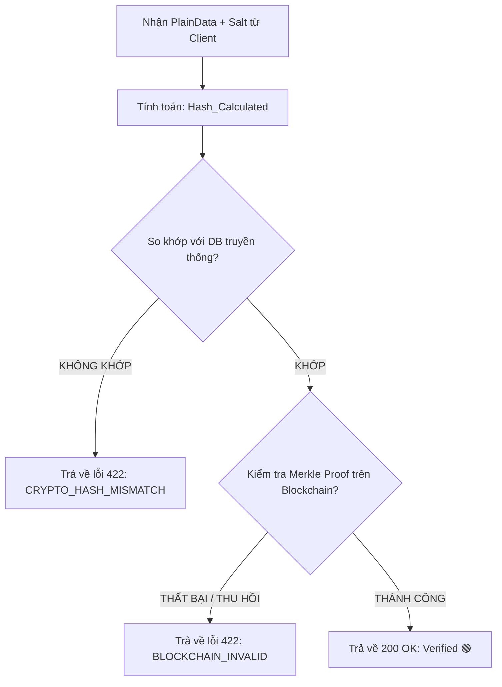

# 📑 ĐẶC TẢ LOGIC NGHIỆP VỤ CHI TIẾT (BUSINESS LOGIC & ENGINE RULES)

## 1. THUẬT TOÁN MÃ HÓA VÀ KIỂM TRA CHÉO (HYBRID VERIFICATION ALGORITHM)

Mô hình này đảm bảo tính toàn vẹn của văn bằng thông qua cơ chế băm mật mã một chiều kết hợp muối (`Salt`) ngẫu nhiên. Dữ liệu gốc (`PlainData`) được bảo mật dưới Local Database, trong khi mã băm đại diện được lưu trữ bất biến trên Smart Contract của Hyperledger Besu.

### A. Quy trình tạo mã băm tại US-1 (Issuance Sequence)

Khi `Registrar` kích hoạt lệnh cấp bằng, hệ thống tự động băm thông tin theo cấu trúc toán học sau:

1. **Chuẩn hóa chuỗi PlainData:** Sắp xếp các khóa của đối tượng văn bằng theo thứ tự bảng chữ cái (Alphabetical Canonical JSON) để đảm bảo chuỗi ký tự sinh ra luôn đồng nhất.
2. **Sinh Salt:** Sinh chuỗi ngẫu nhiên có độ dài cố định 16 ký tự ký số (Hexadecimal Cryptographic Salt).
3. **Công thức băm toán học:**

$$DataHashLocal = \text{SHA-256}(PlainDataCanonical \parallel Salt)$$

*Ví dụ minh họa luồng xử lý chuỗi:*

* `PlainDataCanonical`: `{"classification":"Gioi","degreeCode":"DEG-2026-99102","major":"Software Engineering","studentCode":"STU-88291"}`
* `Salt`: `a7d83bf92c81e3d0`
* Chuỗi kết hợp trước khi đưa vào hàm băm: `{"classification":"Gioi","degreeCode":"DEG-2026-99102","major":"Software Engineering","studentCode":"STU-88291"}a7d83bf92c81e3d0`

### B. Quy trình đối chiếu chéo tại US-3 (Dual-Verification Pipeline)

Khi `Recruiter` hoặc hệ thống thực hiện kiểm tra một văn bằng số, thuật toán sẽ thực hiện kiểm tra chéo 2 tầng:

---

## 2. QUY TẮC TÍNH ĐIỂM UY TÍN (REPUTATION ENGINE RULES - US-5)

Module Uy tín hoạt động theo kiến trúc cắm rời (**Plug-and-play Bounded Context**), tự động tiêu thụ sự kiện `FraudulentDataDetectedEvent` được bắn ra từ hệ thống Core khi Admin phê duyệt đơn khiếu nại (Approved) tại US-4.

### A. Định nghĩa các hằng số phạt điểm (Penalty Metric Constants)

Điểm uy tín gốc của mọi Cơ sở đào tạo (CSDT) khi thiết lập hệ thống mặc định là **$1000$ điểm**.

* $\Delta P_{\text{minor}} = 20$: Điểm phạt cho lỗi cẩu thả hành chính hoặc quy trình nhập liệu nội bộ chậm trễ.
* $\Delta P_{\text{major}} = 150$: Điểm phạt cho các hành vi cố ý làm sai lệch quy chế đào tạo, cấp bằng sai tiêu chuẩn chuẩn đầu ra.
* $\Delta P_{\text{critical}} = 400$: Điểm phạt cho hành vi gian lận hệ thống nghiêm trọng, cấp bằng khống hoặc bán bằng.

### B. Ma trận xử lý sự kiện và Phạt điểm tự động (Event-Driven Reputation Matrix)

Hệ thống tự động tra cứu mã kịch bản lỗi khi Admin thực hiện `Approve()` để đưa ra quyết định trừ điểm hoặc đóng băng tài khoản:

| ID Kịch bản | Phân loại lỗi | Điểm trừ ($\Delta P$) | Trạng thái Hệ thống Cục bộ | Tác động Smart Contract |
| --- | --- | --- | --- | --- |
| **S-01** | Sai thông tin định danh | $-\Delta P_{\text{minor}} = -20$ | Cho phép chạy tiếp | Ghi nhận lịch sử giao dịch phạt điểm |
| **S-02** | Sai kết quả học tập / GPA | $-\Delta P_{\text{minor}} = -20$ | Cho phép chạy tiếp | Ghi nhận lịch sử giao dịch phạt điểm |
| **R-01** | Bằng khống / Bán bằng | $-\Delta P_{\text{critical}} = -400$ | **Đóng băng tài khoản trường** | Kích hoạt Hàm `freezeInstitution()` trên chuỗi |
| **R-02** | Bằng cấp sai chuẩn đầu ra | $-\Delta P_{\text{major}} = -150$ | Cảnh cáo hệ thống | Ghi nhận lịch sử giao dịch phạt điểm |
| **H-01** | Hệ thống/Database bị hack | Không trừ điểm ($0$) | **Đóng băng tạm thời** | Khóa quyền xác thực, chờ kiểm toán bảo mật |

> ⚠️ **Quy tắc miễn trừ đặc biệt (US-2 Shortcut):** Nếu CSDT chủ động phát hiện lỗi và thực hiện lệnh `Revoke` hoặc `Update` khi văn bằng đang ở trạng thái `Pending_Confirmation` (chưa neo chặn lên Blockchain), hệ thống **hoàn toàn miễn trừ phạt điểm**, điểm uy tín được giữ nguyên $100\%$.

---

## 3. THUẬT TOÁN XẾP HẠNG BÀI ĐĂNG TUYỂN DỤNG (RANKING ALGORITHM - US-7)

Để khuyến khích các doanh nghiệp ưu tiên hợp tác và tuyển dụng sinh viên từ các trường có chỉ số uy tín cao, hệ thống áp dụng công thức tính trọng số hiển thị bài đăng (`JobScore`) trên Bảng tin.

Mỗi bài đăng tuyển dụng (`Job`) sẽ được chấm điểm ưu tiên hiển thị dựa trên công thức toán học sau:

$$JobScore = \left( W_{\text{base}} \times \ln(Salary_{Avg}) \right) + \left( W_{\text{rep}} \times \frac{ReputationScore_{\text{partner}}}{1000} \right) + \frac{W_{\text{time}}}{1 + \Delta t}$$

*Trong đó các biến số và trọng số hệ thống được quy định cụ thể:*

* $Salary_{Avg}$: Mức lương trung bình của bài đăng, tính bằng $\frac{SalaryMin + SalaryMax}{2}$.
* $ReputationScore_{\text{partner}}$: Điểm uy tín hiện tại của CSDT được doanh nghiệp liên kết hoặc chọn làm đối tác tiêu chuẩn (Nếu bài đăng không liên kết trường cụ thể, điểm này mặc định lấy bằng giá trị sàn trung bình hệ thống là $500$).
* $\Delta t$: Thời gian trôi qua kể từ thời điểm đăng bài (tính bằng số ngày: $t_{\text{current}} - t_{\text{created}}$).
* Các hệ số cấu hình hệ thống (Weights):
* $W_{\text{base}} = 40$ (Trọng số nền tảng của bài đăng)
* $W_{\text{rep}} = 60$ (Trọng số ưu tiên uy tín của CSDT liên kết)
* $W_{\text{time}} = 100$ (Trọng số suy giảm theo thời gian để làm mới bảng tin)

### Ý nghĩa vận hành của thuật toán:

* Nếu một trường có hành vi bán bằng hoặc làm sai quy chế bị trừ điểm uy tín nghiêm trọng (Ví dụ: Điểm `ReputationScore` tụt từ $1000$ xuống $450$), thành phần $\frac{ReputationScore_{\text{partner}}}{1000}$ sẽ sụt giảm mạnh từ $1.0$ xuống $0.45$.
* Hệ quả trực tiếp là toàn bộ các bài đăng tuyển dụng hướng mục tiêu đến sinh viên trường đó hoặc các tin tức hợp tác đào tạo giữa doanh nghiệp và trường sẽ bị kéo sụt điểm `JobScore`, tự động bị đẩy xuống cuối trang tìm kiếm của ứng dụng Frontend, giảm khả năng tiếp cận nguồn lực ứng viên.