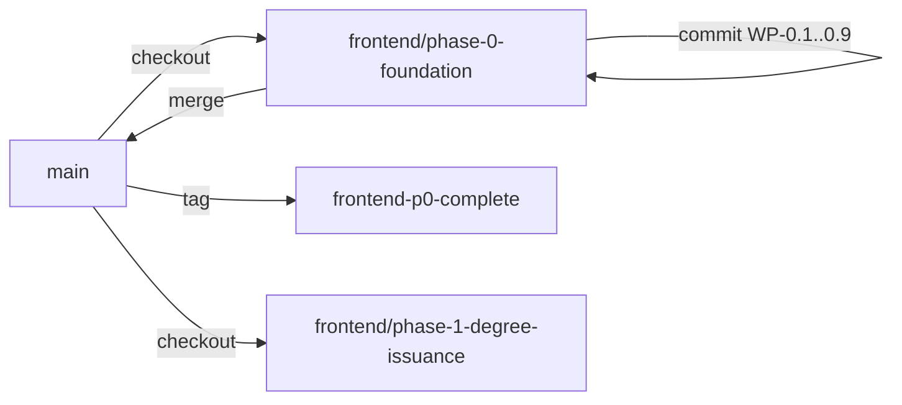

# ChainDegree Frontend Implementation Plan

Kế hoạch triển khai chi tiết cho phần **Frontend** của hệ thống ChainDegree. Kế hoạch được tổ chức thành **7 Phase** theo nguyên tắc **feature-driven vertical slices**, đồng bộ với [implementation-plan.md](file:///e:/codes/chaindegree/docs/implementation-plan.md) của Backend và tuân thủ [Coding-Standards.md](file:///e:/codes/chaindegree/docs/Coding-Standards.md), [AI_CONTEXT.md](file:///e:/codes/chaindegree/docs/AI_CONTEXT.md), và các ràng buộc kiến trúc trong [AGENTS.md](file:///e:/codes/chaindegree/.agents/AGENTS.md).

> [!IMPORTANT]
> Frontend hiện tại ở `apps/frontend/` chỉ chứa 1 file `index.html` tĩnh thử nghiệm (có thể xóa/ghi đè). Toàn bộ hạ tầng Frontend SPA sẽ được xây dựng từ đầu tại `apps/frontend/`.

---

## Mục Tiêu Chung (Overall Goal)

Xây dựng **SPA Frontend MVP** cho hệ thống ChainDegree bao phủ toàn bộ 7 User Stories (US-1 → US-7), đồng bộ hoàn toàn với API Backend, tuân thủ nguyên tắc **KISS**, **Feature-based architecture**, UI/UX tiếng Anh 100%, và đặt nền móng chuẩn để mở rộng lâu dài.

**Expected Outcome:** Ứng dụng SPA hoàn chỉnh bằng **English** cho 4 actors (Registrar, Student, Recruiter, Admin) với các trang nghiệp vụ chính, kết nối API thật (kèm fallback an toàn cho endpoints đang bổ sung), route protection, complete mock auth layer, SignalR realtime, và bộ test đầy đủ.

---

## UI/UX Language & Design Standard

> [!IMPORTANT]
> **Full English UI/UX**: Toàn bộ giao diện người dùng — bao gồm nhãn (labels), nút bấm (buttons), thông báo toast, thông điệp lỗi (error messages), nhãn trạng thái (status badges), ô nhập liệu (placeholders), bảng (tables), dialogs — **sử dụng 100% tiếng Anh**.
> - Hỗ trợ đa ngôn ngữ (i18n) sẽ được hỗ trợ ở giai đoạn sau, không nằm trong phạm vi MVP.

---

## Git Branch Strategy (Chiến Lược Nhánh Git Theo Phase)

Mỗi **Phase** được phát triển trên **1 git branch riêng biệt**, checkout từ `main` và merge lại qua Pull Request hoặc merge trực tiếp sau khi hoàn thành toàn bộ các Work Packages (WPs) thuộc Phase đó.

### Quy Ước Đặt Tên Nhánh (Branch Naming Convention)

```text
frontend/phase-<N>-<short-description>
```

**Bảng tra cứu danh sách nhánh theo Phase:**

| Phase | Tên Nhánh Git | Phạm Vi Triển Khai |
|---|---|---|
| **Phase 0** | `frontend/phase-0-foundation` | Vite + React + TS, Tailwind v4 + shadcn/ui, Feature-based structure, Shared Infra, Complete Mock Auth UI with Role Switcher, App Shell & Router |
| **Phase 1** | `frontend/phase-1-degree-issuance` | Degree Types, API, Dynamic Issuance Form, Degree List Page with Status Badges, Detail Page, SignalR Realtime Updates |
| **Phase 2** | `frontend/phase-2-degree-update-revocation` | Revoke & Update API, Hooks, Modal Cập nhật, Dialog Thu hồi, Contextual Toast by Shortcut Status, Extended Status Badges |
| **Phase 3** | `frontend/phase-3-degree-verification` | Public Verification Portal Page (`/verify`), Anonymous Verification Form, Visual States (Valid/Revoked/Not Found/Pulsing Orange Warning) |
| **Phase 4** | `frontend/phase-4-complaints-reports` | Report API & Multipart Types, Report Form Modal + Drag-and-Drop File Upload (≤5MB), Admin Report Review Page, Admin Sidebar |
| **Phase 5** | `frontend/phase-5-reputation-engine` | Reputation Score & History API, Dashboard Page with Recharts Line Chart, Score Color-coding, Module Feature Toggle Guard |
| **Phase 6** | `frontend/phase-6-recruitment-application` | Job Posting Form + Dynamic Degree Filters, Job Listings Page (sorted by JobScore), Application Flow + Yellow Warning Force Submit Modal, Applicant Management |
| **Phase 7** | `frontend/phase-7-deployment-hardening` | Integration Test Suite (14 E2E Scenarios with MSW), Responsive Polish, Accessibility Audit, Performance Optimization, README & SYSTEM_BRAIN Update |

### Quy Trình Làm Việc (Git Workflow Rules)

1. **Checkout**: Mỗi Phase tạo nhánh riêng từ `main` (ví dụ `git checkout -b frontend/phase-0-foundation main`).
2. **Commit per WP**: Mỗi WP hoàn thành được commit với message chuẩn conventional commits (`feat:`, `fix:`, `docs:`, `chore:`, `test:`).
3. **PR & Merge**: Sau khi hoàn thành tất cả WPs trong Phase, merge nhánh Phase vào `main`.
4. **Tag Hoàn Thành Phase**: Sau khi merge, đánh tag: `frontend-p<N>-complete` (ví dụ `frontend-p0-complete`).



---

## Các Quyết Định Kỹ Thuật Tổng Quát (Cross-Phase Technical Decisions)

| Quyết định | Lựa chọn | Lý do |
|---|---|---|
| Framework | **React 19 + TypeScript** | Phổ biến, hệ sinh thái lớn, phù hợp SPA (Coding-Standards §1) |
| Build tool | **Vite** | Tốc độ dev nhanh, HMR tốt (Coding-Standards §1) |
| Routing | **React Router v7** | Mature, hỗ trợ nested routes, lazy loading |
| Server State | **TanStack Query v5** | Caching, retry, refetch tự động (Coding-Standards §10) |
| Form | **React Hook Form + Zod** | Validate + type inference (Coding-Standards §11) |
| HTTP Client | **Axios** (singleton instance) | Interceptor cho auth/error (Coding-Standards §6) |
| UI Library | **TailwindCSS v4 + shadcn/ui** | Tái sử dụng, đẹp, nhanh (Coding-Standards §24) |
| Charting | **Recharts** | React-first, nhẹ, phù hợp cho Line Chart (Phase 5) |
| Realtime | **SignalR Client (`@microsoft/signalr`)** | Nhận update trạng thái degree real-time (Phase 1) |
| Global State | **React Context API** | Chỉ dùng cho Auth, Theme, Sidebar (Coding-Standards §Mức 7) |
| Linting | **ESLint + Prettier + .editorconfig** | Chuẩn hóa codebase (Coding-Standards §16) |
| Testing | **Vitest + React Testing Library** | Đồng bộ Vite, nhanh, hỗ trợ React |
| Folder structure | **Feature-based** (`app/`, `features/`, `shared/`) | Coding-Standards §3, §Mức 7 |
| Path alias | `@/` | Coding-Standards §15 |

### Danh sách KHÔNG sử dụng (MVP Exclusions — Coding-Standards §Mức 7)

- ❌ Redux / Zustand / XState
- ❌ Next.js / SSR / SSG
- ❌ Micro Frontend / Feature-Sliced Design đầy đủ
- ❌ Storybook / Atomic Design
- ❌ GraphQL / WebSocket (dùng SignalR cho realtime status updates)
- ❌ CSS Modules / i18n (UI tiếng Anh hoàn toàn cho MVP)
- ❌ Premature optimization (`useMemo`, `useCallback` khi chưa cần)

---

## Cấu Trúc Thư Mục Mục Tiêu (Target Directory Structure)

```text
apps/frontend/
├── public/
├── src/
│   ├── app/
│   │   ├── router/
│   │   │   ├── AppRouter.tsx
│   │   │   ├── ProtectedRoute.tsx
│   │   │   └── routes.ts
│   │   ├── providers/
│   │   │   ├── AppProviders.tsx
│   │   │   ├── AuthProvider.tsx     (Auth interface — swappable MockAuthProvider / RealAuthProvider)
│   │   │   ├── QueryProvider.tsx
│   │   │   └── ThemeProvider.tsx
│   │   ├── config/
│   │   │   └── env.ts
│   │   └── layouts/
│   │       ├── DashboardLayout.tsx
│   │       └── PublicLayout.tsx
│   ├── features/
│   │   ├── auth/                    (Full Auth UI: Login page, Role Switcher, Temp mock credentials)
│   │   ├── degree/                  (Issuance form, List, Detail, Update modal, Revoke dialog, SignalR)
│   │   ├── verification/            (Public Verification Portal Page & Visual States)
│   │   ├── report/                  (Submit Report modal with File Upload, Admin Review page, Evidence view)
│   │   ├── reputation/              (Reputation Dashboard, Recharts Line Chart, Feature Toggle Guard)
│   │   └── recruitment/             (Post Job with Degree Filters, Job List, Apply + Force Submit Modal, Applicants)
│   ├── shared/
│   │   ├── api/
│   │   │   ├── http.ts              (Axios singleton — 10s timeout, granular error interceptor)
│   │   │   └── error-mapper.ts      (ApiErrorMapper - English error messages)
│   │   ├── components/
│   │   │   ├── ui/                  (shadcn/ui components)
│   │   │   ├── ErrorBoundary.tsx
│   │   │   ├── LoadingSpinner.tsx
│   │   │   ├── EmptyState.tsx
│   │   │   └── StatusBadge.tsx
│   │   ├── hooks/
│   │   ├── lib/
│   │   │   ├── date.ts              (Date formatting in English)
│   │   │   └── signalr.ts           (SignalR connection helper)
│   │   ├── types/
│   │   │   └── api.types.ts
│   │   ├── services/
│   │   │   └── notification.service.ts
│   │   └── utils/
│   ├── assets/
│   └── main.tsx
├── package.json
├── tsconfig.json
├── vite.config.ts
├── tailwind.config.ts
├── .env.example
├── .eslintrc.cjs
├── .prettierrc
└── .editorconfig
```

---

## Danh Sách Endpoints API & Chiến Lược Kết Nối (API Integration Strategy)

Tham chiếu từ [DegreesController.cs](file:///e:/codes/chaindegree/apps/backend/ChainDegree/src/ChainDegree.API/Controllers/DegreesController.cs), [ReportsController.cs](file:///e:/codes/chaindegree/apps/backend/ChainDegree/src/ChainDegree.API/Controllers/ReportsController.cs), [RecruitmentController.cs](file:///e:/codes/chaindegree/apps/backend/ChainDegree/src/ChainDegree.API/Controllers/RecruitmentController.cs):

### 1. Endpoints Đã Được Triển Khai Tại Backend

| Endpoint | Method | Auth | FE Feature | BE Controller |
|---|---|---|---|---|
| `POST /api/v1/institutions/degrees` | POST | Registrar | `degree` | `DegreesController.IssueDegrees` |
| `GET /api/v1/institutions/degrees/batches/{batchId}` | GET | Registrar | `degree` | `DegreesController.GetBatchStatus` |
| `POST /api/v1/institutions/degrees/{id}/retry` | POST | Registrar | `degree` | `DegreesController.RetryDegreeConfirmation` |
| `POST /api/v1/institutions/degrees/{id}/revoke` | POST | Registrar | `degree` | `DegreesController.RevokeDegree` |
| `PUT /api/v1/institutions/degrees/{id}` | PUT | Registrar | `degree` | `DegreesController.UpdateDegree` |
| `POST /api/v1/institutions/degrees/verify` | POST | Anonymous | `verification` | `DegreesController.VerifyDegree` |
| `POST /api/v1/institutions/degrees/reports` | POST | Student/Recruiter | `report` | `ReportsController.SubmitReport` |
| `GET /api/v1/institutions/reports/{id}/evidence` | GET | Student/Recruiter/Admin | `report` | `ReportsController.GetReportEvidence` |
| `POST /api/v1/institutions/reports/{id}/approve` | POST | Admin | `report` | `ReportsController.ApproveReport` |
| `POST /api/v1/institutions/reports/{id}/reject` | POST | Admin | `report` | `ReportsController.RejectReport` |
| `POST /api/v1/recruitment/jobs` | POST | Recruiter | `recruitment` | `RecruitmentController.PostJob` |
| `POST /api/v1/recruitment/applications` | POST | Student | `recruitment` | `RecruitmentController.ApplyForJob` |
| `GET /api/v1/recruitment/jobs` | GET | Anonymous | `recruitment` | `RecruitmentController.GetJobs` |

### 2. Endpoints Đang Bổ Sung Cần Cập Nhật Vào `api-specification.md`

| Endpoint | Method | Auth | FE Feature |
|---|---|---|---|
| `GET /api/v1/institutions/degrees` | GET | Registrar | `degree` |
| `GET /api/v1/institutions/degrees/{id}` | GET | Registrar | `degree` |
| `GET /api/v1/institutions/reports` | GET | Admin | `report` |
| `GET /api/v1/recruitment/applications` | GET | Recruiter | `recruitment` |
| `GET /api/v1/reputation/{institutionId}` | GET | Any | `reputation` |
| `GET /api/v1/reputation/{institutionId}/history` | GET | Any | `reputation` |

### 3. Error Handling Strategy (Phân Loại Lỗi Theo HTTP Status)

FE gọi trực tiếp tất cả URL endpoint chuẩn. Xử lý lỗi theo **từng loại HTTP status**, không gộp chung:

| HTTP Status / Error Type | Xử Lý Phía FE | UI Hiển Thị |
|---|---|---|
| `200` / `201` | Thành công, render data | Data table / Detail card / Toast success |
| `404` (Not Found / Endpoint chưa có) | **Empty State** | *"No degrees found"*, *"No reports pending review"*, etc. |
| `401` (Unauthorized) | Redirect `/login` | Auto redirect, clear auth token |
| `403` (Forbidden) | **Error State** | *"You do not have permission to access this resource."* |
| `409` (Conflict) | **Inline Error** | Inline red message trên form row bị conflict |
| `422` (Validation Error) | **Form Error / Modal** | Zod-mapped field errors hoặc Force Submit Modal |
| `500` (Server Error) | **Error State** | *"Something went wrong on our end. Please try again later."* + nút `[Retry]` |
| `timeout` | **Error State + Retry** | *"Request timed out. Please check your connection and try again."* + nút `[Retry]` |
| `Network Error` (no response) | **Error State + Retry** | *"Unable to connect to the server. Please check your internet connection."* + nút `[Retry]` |
| `cancelled` (AbortController) | Silent | Không hiển thị gì (request bị cancel do user navigation) |

> [!WARNING]
> **Quan trọng**: `404` và `500` phải xử lý KHÁC NHAU. `404` → empty state (dữ liệu không có). `500` → error state (hệ thống lỗi, user cần biết). Không được gộp `500` vào empty state vì sẽ khiến user hiểu sai khi database chết mà UI hiện *"No data found"*.

---

## Phase 0: Project Foundation, Toolchain & Complete Mock Auth UI

**Git Branch:** `frontend/phase-0-foundation`

**Mục tiêu:** Dựng toàn bộ hạ tầng kỹ thuật FE, cấu hình toolchain, thiết lập ranh giới feature, hoàn thiện giao diện Auth UI với dữ liệu temp mock và Role Switcher, và tạo design system baseline. Sau phase này, mọi phase tiếp theo có thể bắt tay viết feature ngay mà không lo hạ tầng.

### Scope

#### WP-0.1: Khởi tạo Vite + React + TypeScript

- Khởi tạo dự án React + TypeScript bằng `npx -y create-vite@latest ./ --template react-ts` tại `apps/frontend/`.
- Xóa boilerplate mặc định (App.css, logo, counter demo).
- Cấu hình `tsconfig.json` với `strict: true`, path alias `@/*` → `src/*`.
- Cấu hình `vite.config.ts` với resolve alias và dev server port (`3000`).
- Tạo `.env.example` với đầy đủ env vars:
  - `VITE_APP_NAME=ChainDegree`
  - `VITE_API_BASE_URL=http://localhost:5000`
  - `VITE_API_TIMEOUT=10000`
  - `VITE_SIGNALR_URL=http://localhost:5000/hubs/degree-status`
  - `VITE_REPUTATION_ENABLED=true`

#### WP-0.2: Cấu hình Linting & Formatting

- ESLint: config mở rộng `eslint:recommended`, `plugin:@typescript-eslint/recommended`, `plugin:react-hooks/recommended`.
- Prettier: 2 spaces, single quote, trailing comma, print width 100.
- `.editorconfig`: UTF-8, LF, indent 2.
- Script trong `package.json`: `lint`, `lint:fix`, `format`.

#### WP-0.3: TailwindCSS v4 + shadcn/ui Setup

- Cài đặt TailwindCSS v4 theo cách cấu hình của Vite.
- Cài đặt và cấu hình `shadcn/ui` (CLI init).
- Tạo `src/shared/components/ui/` chứa base components từ shadcn: `Button`, `Input`, `Card`, `Dialog`, `Select`, `Table`, `Badge`, `Toast` (Sonner), `Textarea`, `Tabs`, `DropdownMenu`.
- Thiết lập theme tokens: colors, border-radius, font-family (Inter từ Google Fonts).

#### WP-0.4: Cấu trúc Thư mục Feature-Based

- Tạo toàn bộ cấu trúc thư mục như Target Directory Structure ở trên.
- Mỗi feature folder có file `index.ts` (public API barrel export).
- Cấu hình ESLint rule hoặc convention doc cấm import nội bộ cross-feature.

#### WP-0.5: Shared Infrastructure

- **HTTP Client** (`@/shared/api/http.ts`):
  - Axios singleton instance.
  - Base URL từ `VITE_API_BASE_URL`.
  - Timeout: `VITE_API_TIMEOUT` (default `10s`).
  - Request interceptor: gắn `Authorization: Bearer <token>` (⚠️ **KHÔNG** `console.log(config)` — tránh lộ token).
  - Response interceptor phân loại lỗi theo HTTP status (xem bảng Error Handling Strategy): `401` → redirect login, `403` → forbidden toast, `404` → empty state, `409` → conflict inline error, `422` → validation errors, `500` → server error state + retry, `timeout` → timeout error + retry, `network error` → connection error + retry, `cancelled` → silent ignore.
- **API Error Mapper** (`@/shared/api/error-mapper.ts`):
  - **Hai tầng mapping**:
    - Tầng 1: HTTP Status → loại UI state (empty / error / retry / inline / redirect) — xem bảng ở phần Error Handling Strategy.
    - Tầng 2: Business error codes → **English** user-friendly messages.
  - Business error codes: `DEGREE_ALREADY_EXISTS`, `CRYPTO_HASH_MISMATCH`, `BLOCKCHAIN_INVALID`, `DEGREE_NOT_FOUND`, `UNSUPPORTED_VERSION`, `FILTER_CRITERIA_NOT_SATISFIED`, `Report.EvidenceRequired`, etc.
  - Ví dụ: `CRYPTO_HASH_MISMATCH` → *"Verification failed. The provided data does not match official records."*
  - Ví dụ: `500` (no business code) → *"Something went wrong on our end. Please try again later."*
  - ⚠️ **KHÔNG** map `500` thành generic *"Something went wrong"* cho tất cả — phải phân biệt `500` vs `timeout` vs `network error` bằng message riêng.
- **Notification Service** (`@/shared/services/notification.service.ts`):
  - Wrapper trên toast library (sonner).
  - Methods: `success()`, `error()`, `warning()`, `info()`.
- **Date Utils** (`@/shared/lib/date.ts`):
  - `formatDate()`, `formatDateTime()`, `formatRelativeTime()` (English locale formatting).
- **Shared Types** (`@/shared/types/api.types.ts`):
  - `ApiResult<T>`, `ApiError`, `PaginatedResponse<T>`.
  - `DegreeStatus`: `"Pending_Confirmation" | "Confirmed" | "Confirmation_Error" | "Pending_Update" | "Pending_Revocation" | "Revoked" | "Frozen"`.
  - `ReportStatus`: `"Pending_Review" | "Approved" | "Rejected"`.
  - `RankStatus`: `"Highly_Qualified" | "Under_Qualified"`.

#### WP-0.6: App Shell, Router & Complete Mock Auth UI

- **Auth Module — Provider Pattern (MockAuthProvider / RealAuthProvider)**:
  - Định nghĩa `AuthContextType` interface: `currentUser`, `roles`, `login()`, `logout()`, `isAuthenticated`.
  - Tạo **`MockAuthProvider`**: implements `AuthContextType` với temp mock user data + Role Switcher cho 4 roles (`Registrar`, `Student`, `Recruiter`, `Admin`). Không phụ thuộc BE.
  - Tạo placeholder **`RealAuthProvider`**: (sẽ tích hợp `ControlHub` sau). Cùng interface, swap dễ dàng qua env flag.
  - `AppProviders` inject provider dựa trên config: `MockAuthProvider` khi development, `RealAuthProvider` khi production. Tránh `if (DEV)` / `if (MOCK)` rải rác khắp codebase.
  - Auth Page `/login`: Giao diện Login hoàn chỉnh có **Role Switcher** chọn nhanh 4 roles kèm dữ liệu temp mock.
- **AppRouter** (`@/app/router/`):
  - React Router v7 với **lazy loading cho pages only**.
  - Layout components (`DashboardLayout`, `PublicLayout`) **KHÔNG lazy** — load ngay.
  - Chỉ lazy import `React.lazy(() => import(...))` cho page-level route components.
  - `ProtectedRoute` component: kiểm tra role, redirect `/login` nếu chưa auth.
  - Route mapping cho tất cả các trang.
- **Layouts** (loaded eagerly, not lazy):
  - `DashboardLayout`: Sidebar + Header + Content area.
  - `PublicLayout`: Header đơn giản + Content.
- **Error Boundary** (`@/shared/components/ErrorBoundary.tsx`):
  - Bọc router chính.
  - Fallback UI thân thiện bằng tiếng Anh + nút *"Try Again"*.
  - ⚠️ **Scope**: ErrorBoundary chỉ bắt **React render errors** (component crash, null reference trong render). **KHÔNG** dùng ErrorBoundary để bắt Axios errors / network errors / API errors — những lỗi đó phải xử lý trong TanStack Query `onError` callbacks và `error-mapper.ts`.
- **Loading / Empty / Error States**: Skeleton components cơ bản + `ErrorState` component (*"Something went wrong"* + `[Retry]` button).

#### WP-0.7: Shared UI Components Baseline

- `StatusBadge`: Component hiển thị badge theo degree status (🟡🟢🔴 colors).
- `LoadingSpinner`: Spinner animation.
- `EmptyState`: *"No data available"* placeholder.
- `ConfirmDialog`: Modal xác nhận hành động nguy hiểm.
- `FileUpload`: Drag-and-drop file upload component.

### Constraints

- **KHÔNG** implement bất kỳ nghiệp vụ feature nào ngoài Auth UI temp data.
- **KHÔNG** kết nối API thật cho Auth. Auth provider dùng temp mock data với Role Switcher.
- Tất cả lazy routes trỏ tới placeholder pages với text *"Coming Soon"*.
- 100% UI text phải là **English**.

### Done Criteria

- [ ] `npm run dev` chạy thành công tại `http://localhost:3000`.
- [ ] `npm run lint` không có error.
- [ ] `npm run build` thành công không lỗi TypeScript.
- [ ] Route navigation hoạt động: click sidebar → đúng page placeholder.
- [ ] Login page hiển thị Role Switcher cho 4 roles (`Registrar`, `Student`, `Recruiter`, `Admin`); chọn role cập nhật quyền và sidebar ngay lập tức.
- [ ] Protected route redirect sang `/login` nếu role không khớp.
- [ ] Error Boundary bắt được React render error và hiển thị fallback UI bằng tiếng Anh (KHÔNG catch axios/network errors).
- [ ] Toast notification hoạt động (`notification.success("Test notification")`).
- [ ] Path alias `@/` resolve đúng trong cả IDE và build.
- [ ] `.env.example` có đủ 5 env vars: `VITE_APP_NAME`, `VITE_API_BASE_URL`, `VITE_API_TIMEOUT`, `VITE_SIGNALR_URL`, `VITE_REPUTATION_ENABLED`.
- [ ] MockAuthProvider / RealAuthProvider swap được qua config mà không sửa code business.

### Unit Test Plan

| Test Target | Test Case | Tool |
|---|---|---|
| `error-mapper.ts` | Map known error codes → correct English user message | Vitest |
| `error-mapper.ts` | Distinguish 404 → empty state, 500 → error state, network → retry state | Vitest |
| `date.ts` | `formatDate`, `formatDateTime` output correct English format | Vitest |
| `notification.service.ts` | `success()`, `error()` invoke underlying toast | Vitest |
| `StatusBadge` | Render correct color & label for each DegreeStatus | Vitest + RTL |
| `ProtectedRoute` | Redirect when role mismatches, render content when role matches | Vitest + RTL |
| `ErrorBoundary` | Catch React render error (NOT axios error) and render fallback UI | Vitest + RTL |
| `MockAuthProvider` | Provide mock user, switch role, logout clears state | Vitest + RTL |

### Commits For Phase 0

```
feat(frontend): scaffold Vite + React + TypeScript project
chore(frontend): configure ESLint, Prettier, EditorConfig
feat(frontend): setup TailwindCSS v4 + shadcn/ui design system
chore(frontend): establish feature-based directory structure
feat(frontend): implement shared HTTP client, error mapper, notification service
feat(frontend): create complete mock auth UI with role switcher and router
feat(frontend): add shared UI components (StatusBadge, LoadingSpinner, etc.)
test(frontend): add unit tests for Phase 0 shared utilities and auth guard
```

---

## Phase 1: Degree Issuance UI & Realtime Status (US-1 / UC-1)

**Git Branch:** `frontend/phase-1-degree-issuance`

**Mục tiêu:** Triển khai hoàn chỉnh giao diện cấp bằng cho Registrar, kết nối API Issue Degrees, hiển thị danh sách bằng cấp với trạng thái real-time qua SignalR (kèm polling fallback), và retry cho lỗi xác thực.

### Scope

#### WP-1.1: Feature `degree` — API Layer & Types

- **Types** (`features/degree/degree.types.ts`):
  - `IssueDegreeItemRequest`, `IssueDegreeRequest`, `IssueDegreeResponse`.
  - `DegreeListItem` (cho danh sách), `DegreeDetail`.
  - `BatchStatusResponse`.
- **API Service** (`features/degree/degree.api.ts`):
  - `issueDegrees(data, idempotencyKey)` → `POST /api/v1/institutions/degrees`.
  - `getBatchStatus(batchId)` → `GET .../batches/{batchId}`.
  - `retryDegreeConfirmation(degreeId)` → `POST .../{id}/retry`.
  - `getDegrees()` → `GET /api/v1/institutions/degrees` (fallback data khi BE chưa có).
  - `getDegree(id)` → `GET /api/v1/institutions/degrees/{id}` (fallback data khi BE chưa có).
- **Query Keys Factory** (`features/degree/degree.keys.ts`):
  - `degreeKeys.all`, `degreeKeys.lists()`, `degreeKeys.detail(id)`, `degreeKeys.batchStatus(batchId)`.

#### WP-1.2: Custom Hooks — Mutations & Queries

- `useIssueDegreesMutation`: mutation → on success → invalidate `degreeKeys.lists()` + show toast.
- `useDegreesQuery`: query danh sách degrees (kèm graceful fallback).
- `useDegreeDetailQuery(id)`: query chi tiết 1 degree.
- `useBatchStatusQuery(batchId)`: query batch status.
- `useRetryDegreeMutation(id)`: mutation retry confirmation.

#### WP-1.3: Degree Issuance Form (Core UI)

- **Form Component** (`features/degree/components/IssueDegreeForm.tsx`):
  - Dynamic field array: mỗi item gồm `StudentId (UUID)`, `Major`, `Classification (dropdown)`, `IssuedAt (date picker)`.
  - Nút `[+ Add Degree]` để thêm row mới.
  - Nút `[Remove]` để xóa row.
  - Zod schema validation: required fields, UUID format, valid classification.
  - **Xử lý partial failure**: API có thể trả về `failures[]`. Rows trùng lặp giữ lại trên form + inline error màu đỏ (AC3 US-1), rows thành công bị xóa khỏi form.
  - Submit → generate UUID `Idempotency-Key` → gọi API.
  - Toast thành công: *"Successfully submitted X degree(s). The system is processing verification in the background."*

#### WP-1.4: Degree List Page

- **Page Component** (`features/degree/pages/DegreeListPage.tsx`):
  - Table hiển thị: DegreeCode, StudentName, Major, Classification, Status, IssuedAt, Actions.
  - **Status Badge colors** (theo US-1 AC4):
    - 🟡 `Pending_Confirmation` — yellow badge
    - 🟢 `Confirmed` — green badge
    - 🔴 `Confirmation_Error` — red badge + nút `[Retry]`
  - Nút `[Retry]` → gọi `retryDegreeConfirmation(id)`.
  - Pagination cơ bản.
  - Link sang degree detail page.

#### WP-1.5: Degree Detail Page (Skeleton)

- Trang chi tiết degree hiển thị thông tin đầy đủ.
- Placeholders cho nút `[Update]` và `[Revoke]` (Phase 2).
- Placeholder cho nút `[Report Issue]` (Phase 4).

#### WP-1.6: SignalR Realtime Status Updates

- Tích hợp `@microsoft/signalr` client helper (`@/shared/lib/signalr.ts`).
- Hub URL từ env: `VITE_SIGNALR_URL`.
- Kết nối tới SignalR Hub của Backend (khi BE phát sự kiện `DegreeStatusUpdated` hoặc `BatchCompleted`).
- Khi nhận sự kiện realtime: Tự động invalidate `degreeKeys.all` để UI tự cập nhật trạng thái từ 🟡 `Pending_Confirmation` → 🟢 `Confirmed` / 🔴 `Confirmation_Error` không cần F5.
- **Polling chỉ kích hoạt khi SignalR bị disconnect** (không chạy đồng thời):
  - Khi SignalR connected → polling disabled.
  - Khi SignalR disconnected / reconnecting → bật polling 5s interval (`refetchInterval: 5000`).
  - Khi SignalR reconnect thành công → tắt polling, quay lại SignalR event.
  - ⚠️ Không polling đồng thời với SignalR — tránh lãng phí bandwidth `GET /degrees` mỗi 5s khi SignalR vẫn hoạt động.

### Constraints

- Tuân thủ Feature Boundary Rules: tất cả import từ `features/degree` phải qua `index.ts`.
- **Idempotency-Key**: Mỗi request `POST /degrees` phải có header `Idempotency-Key: <uuid>`.
- Component chỉ render; business logic (validation, error mapping) đặt trong hooks/helpers.
- English 100% cho mọi nhãn và thông báo.

### Done Criteria

- [ ] Registrar có thể mở form cấp bằng, thêm nhiều bằng, submit thành công.
- [ ] Form validate client-side: required fields, UUID format.
- [ ] Submit gọi đúng API `POST /api/v1/institutions/degrees` với header Idempotency-Key.
- [ ] Partial failure: rows lỗi giữ lại + inline error, rows thành công bị xóa.
- [ ] Toast thành công hiển thị message tiếng Anh chính xác.
- [ ] Danh sách bằng cấp hiển thị đúng status badge colors.
- [ ] Nút `[Retry]` hoạt động cho `Confirmation_Error` degrees.
- [ ] SignalR nhận event và cập nhật badge realtime; polling chỉ bật khi SignalR disconnected (không chạy đồng thời).
- [ ] Loading/Empty/Error states xử lý đầy đủ.

### Unit Test Plan

| Test Target | Test Case |
|---|---|
| `degree.api.ts` | Mock axios, verify correct URL/method/headers cho mỗi function |
| `useIssueDegreesMutation` | Mock API response, verify cache invalidation & toast |
| `IssueDegreeForm` (Zod schema) | Valid/invalid form data, required fields, UUID format |
| `StatusBadge` integration | Render correct color & label for each DegreeStatus |
| `degree.keys.ts` | Query key factory returns correct structure |

### Commits For Phase 1

```
feat(degree): define types, API service, and query key factory
feat(degree): implement issuance mutations and queries hooks
feat(degree): build dynamic degree issuance form with Zod validation
feat(degree): create degree list page with status badges
feat(degree): add degree detail page skeleton
feat(degree): integrate SignalR realtime status update listener with polling fallback
test(degree): add unit tests for degree API, hooks, and form validation
```

---

## Phase 2: Degree Update & Revocation UI (US-2 / UC-2)

**Git Branch:** `frontend/phase-2-degree-update-revocation`

**Mục tiêu:** Triển khai giao diện cập nhật và thu hồi bằng cấp, xử lý đúng logic shortcut cho `Pending_Confirmation` và async flow cho `Confirmed`.

### Scope

#### WP-2.1: API & Types Bổ Sung

- **Types mới**:
  - `RevokeDegreeRequest { reasonCode: string }`.
  - `RevokeDegreeResponse { degreeId, currentStatus, reputationImpact, isShortcut }`.
  - `UpdateDegreeRequest { major, classification, reasonCode }`.
  - `UpdateDegreeResponse { degreeId, currentStatus, isShortcut }`.
  - `RevocationReasonCode` enum: predefined reason categories.
- **API Service bổ sung**:
  - `revokeDegree(id, request)` → `POST .../degrees/{id}/revoke`.
  - `updateDegree(id, request)` → `PUT .../degrees/{id}`.

#### WP-2.2: Custom Hooks

- `useRevokeDegreeMutation(id)`: mutation → on success → invalidate `degreeKeys.detail(id)` + `degreeKeys.lists()` → contextual toast.
- `useUpdateDegreeMutation(id)`: mutation → on success → invalidate caches → toast.

#### WP-2.3: Degree Detail Page — Update & Revoke Actions

- **Nút `[Update]`**: Mở modal form chỉnh sửa Major, Classification + bắt buộc chọn Lý do thay đổi (dropdown predefined reasons).
- **Nút `[Revoke Degree]`**: Mở `ConfirmDialog` yêu cầu chọn Lý do thu hồi + textarea mô tả.
- **Conditional UI theo trạng thái gốc** (AC3 US-2):
  - Nếu degree đang `Pending_Confirmation`:
    - Revoke → Toast: *"Degree revoked successfully. Reputation assessment exempted for unanchored degrees."* → Badge chuyển 🔴 `Revoked` ngay lập tức.
    - Update → Cập nhật trực tiếp, toast: *"Degree information updated successfully."*
  - Nếu degree đang `Confirmed`:
    - Revoke → Toast: *"Revocation request accepted. Processing blockchain synchronization in the background."* → Badge chuyển 🟡 `Pending_Revocation`.
    - Update → Toast: *"Update request accepted. Processing in the background."* → Badge chuyển 🟡 `Pending_Update`.

#### WP-2.4: Status Badges Mở Rộng

- Thêm badge cho `Pending_Update` (🟡), `Pending_Revocation` (🟡), `Revoked` (🔴), `Frozen` (⚫).

### Constraints

- Nút `[Update]` và `[Revoke Degree]` chỉ hiển thị khi degree ở `Confirmed` hoặc `Pending_Confirmation` (AC1 US-2).
- Toast message phải khác nhau dựa trên `isShortcut` trong response (Coding-Standards §19).
- Ownership check: chỉ Registrar thuộc institution sở hữu degree mới thấy nút.
- UI tiếng Anh 100%.

### Done Criteria

- [ ] Nút `[Update]` và `[Revoke Degree]` hiển thị đúng điều kiện.
- [ ] Modal cập nhật: validate required fields + reason code.
- [ ] API calls `PUT` và `POST .../revoke` gọi đúng.
- [ ] Shortcut response (`Pending_Confirmation`): status update ngay, toast message đúng.
- [ ] Async response (`Confirmed`): status chuyển sang pending, toast message đúng.
- [ ] Cache invalidation sau mutation.
- [ ] Danh sách degrees phản ánh trạng thái mới sau update/revoke.

### Unit Test Plan

| Test Target | Test Case |
|---|---|
| `useRevokeDegreeMutation` | Verify shortcut vs async toast messages in English |
| `useUpdateDegreeMutation` | Verify cache invalidation |
| Update Form Zod schema | Required reason, valid classification values |
| Revoke ConfirmDialog | Required reason, cancel does not trigger API |
| Conditional button visibility | Buttons hidden for invalid statuses |

### Commits For Phase 2

```
feat(degree): add revoke and update API types and service methods
feat(degree): implement revoke and update mutation hooks
feat(degree): build update modal and revoke confirm dialog
feat(degree): add contextual English toast messages based on shortcut status
feat(degree): extend status badges for pending update, pending revocation, and frozen
test(degree): add unit tests for update and revocation flows
```

---

## Phase 3: Public Degree Verification UI (US-3 / UC-3)

**Git Branch:** `frontend/phase-3-degree-verification`

**Mục tiêu:** Triển khai trang công khai **Verification Portal** cho phép bất kỳ ai xác thực văn bằng mà không cần đăng nhập, với các visual states trực quan.

### Scope

#### WP-3.1: Feature `verification` — API & Types

- **Types**:
  - `VerifyDegreeRequest { degreeCode, version?, issuedAt?, plainDataJson?, salt? }`.
  - `VerifyDegreeSuccessResponse { verified, verificationSource, blockchainTxHash, blockNumber, degreeDetails }`.
  - `VerifyDegreeErrorResponse { verified: false, errorCode, message }`.
  - `VerificationResult` union type: `Verified | Revoked | CryptoHashMismatch | BlockchainInvalid | DegreeNotFound | UnsupportedVersion`.
- **API Service**:
  - `verifyDegree(request)` → `POST /api/v1/institutions/degrees/verify`.

#### WP-3.2: Verification Portal Page

- **Route**: `/verify` (PublicLayout, `[AllowAnonymous]`).
- **Input Form**:
  - Ô nhập Degree Code — required.
  - Ô nhập Version — optional integer.
  - Nút `[Verify]`.
- **Result Display** (Visual states theo US-3 AC3):
  - ✅ **Valid** (`verified: true`, status `Confirmed`):
    - Khung viền xanh lá, badge 🟢.
    - Hiển thị: Institution Name, Major, Classification, TxHash, BlockNumber.
  - 🔴 **Revoked** (`verified: false`, status `Revoked`):
    - Khung viền đỏ, badge 🔴.
    - Cảnh báo: *"This degree has been revoked by the issuing institution."*
  - ❌ **Not Found** (`DEGREE_NOT_FOUND` / `UNSUPPORTED_VERSION`):
    - Thông báo: *"No degree found with the specified code."*

#### WP-3.3: Tampered Data Pulsing Warning

- 🟠 **Integrity Failure** (`CRYPTO_HASH_MISMATCH` hoặc `BLOCKCHAIN_INVALID`):
  - **Pulsing orange border** (CSS animation `@keyframes pulse-warning`).
  - Critical warning text: *"⚠️ CRITICAL WARNING: Data integrity compromised. The underlying database may have been tampered with."*

#### WP-3.4: UX Polish

- Loading skeleton khi đang gọi API.
- Clear result khi thay đổi input.
- Responsive layout tối ưu cho mobile devices.

### Constraints

- **Không yêu cầu đăng nhập** — route nằm ngoài `ProtectedRoute`.
- **Không mutate state** — Verification là pure query operation.
- Response error codes mapping chính xác theo BE `DegreesController`.

### Done Criteria

- [ ] Trang `/verify` truy cập được không cần login.
- [ ] Input validation: DegreeCode required.
- [ ] API gọi đúng `POST /api/v1/institutions/degrees/verify`.
- [ ] Kết quả Valid hiển thị khung xanh + thông tin blockchain.
- [ ] Kết quả Revoked hiển thị khung đỏ + thông báo cảnh báo.
- [ ] Kết quả Hash Mismatch hiển thị khung cam nhấp nháy + cảnh báo nguy hiểm.
- [ ] Kết quả Not Found hiển thị message rõ ràng.
- [ ] Responsive trên mobile viewports.

### Unit Test Plan

| Test Target | Test Case |
|---|---|
| `verification.api.ts` | Verify correct request payload shape |
| VerificationPortal component | Render correct visual state for each result type (valid/revoked/mismatch/not-found) |
| Zod schema | DegreeCode required, version optional integer |
| Error mapping | Backend error codes → correct English UI display |

### Commits For Phase 3

```
feat(verification): define types and API service for degree verification
feat(verification): build public verification portal page with visual states
feat(verification): add pulsing warning animation for tampered data integrity failure
test(verification): add unit tests for verification flow and visual states
```

---

## Phase 4: Complaints & Reports UI (US-4 / UC-4)

**Git Branch:** `frontend/phase-4-complaints-reports`

**Mục tiêu:** Triển khai giao diện gửi báo cáo sai sót/gian lận cho Student và Recruiter, và giao diện duyệt báo cáo cho Admin.

### Scope

#### WP-4.1: Feature `report` — API & Types

- **Types**:
  - `ReportTypeEnum = "Administrative_Error" | "Fraudulent_Data"`.
  - `ReportStatusEnum = "Pending_Review" | "Approved" | "Rejected"`.
  - `SubmitReportRequest` (FormData: `degreeId`, `reportType`, `description`, `evidenceFile`).
  - `SubmitReportResponse { reportId, degreeId, status, evidenceUrl, createdAt }`.
  - `ApproveReportResponse`, `RejectReportResponse`.
  - `ReportListItem` (cho Admin review list).
- **API Service** (`features/report/report.api.ts`):
  - `submitReport(formData)` → `POST .../degrees/reports` (`multipart/form-data`).
  - `approveReport(id)` → `POST .../reports/{id}/approve`.
  - `rejectReport(id, reason)` → `POST .../reports/{id}/reject`.
  - `getReportEvidence(id)` → `GET .../reports/{id}/evidence`.
  - `getReports()` → `GET /api/v1/institutions/reports` (kèm graceful fallback).

#### WP-4.2: Report Submission Flow

- **Nút `[Report Issue / Fraud]`** trên Degree Detail Page:
  - Hiển thị khi user role là `Student` (bằng của mình) hoặc `Recruiter` (bất kỳ bằng).
- **Report Form Modal**:
  - Dropdown: Report type (`Administrative_Error` / `Fraudulent_Data`).
  - Textarea: Detailed description (required).
  - **File Upload**: Drag-and-drop zone cho file minh chứng (PDF/PNG/JPG, max 5MB).
  - File validation: type (`.pdf`, `.png`, `.jpg`), size (≤ 5MB).
  - Submit → `multipart/form-data` API call.
  - Toast: *"Report submitted successfully. The system will review it as soon as possible."*

#### WP-4.3: Admin Report Review Page

- **Route**: `/admin/reports` (ProtectedRoute, role `Admin`).
- **Report List Table**: ReportId, DegreeCode, ReporterRole, ReportType, Description (truncated), Status, CreatedAt, Actions.
- **Actions**:
  - `[View Evidence]`: Download/view evidence file.
  - `[Approve]`: ConfirmDialog → gọi `approveReport(id)` → Toast + invalidate list.
  - `[Reject]`: Modal nhập lý do → gọi `rejectReport(id, reason)` → Toast + invalidate list.
- Status badges: 🟡 `Pending_Review`, 🟢 `Approved`, 🔴 `Rejected`.

#### WP-4.4: Admin Sidebar Update

- Thêm menu "Report Management" vào sidebar cho role Admin.

### Constraints

- File upload dùng `multipart/form-data`, size limit 5MB (đồng bộ với BE `[RequestSizeLimit(5_242_880)]`).
- Student chỉ thấy nút báo cáo trên bằng **của mình**.
- Recruiter thấy nút báo cáo trên **bất kỳ** bằng cấp.
- Report approval/rejection: Admin role only.
- English 100%.

### Done Criteria

- [ ] Student thấy nút báo cáo chỉ trên bằng của mình.
- [ ] Recruiter thấy nút báo cáo trên mọi bằng.
- [ ] Modal báo cáo validate: required type, description, evidence file.
- [ ] File upload validate type (.pdf/.png/.jpg) và size (≤ 5MB).
- [ ] API gọi đúng `multipart/form-data`.
- [ ] Toast thành công sau submit.
- [ ] Admin list reports page hiển thị đúng.
- [ ] Approve/Reject hoạt động, status cập nhật.
- [ ] Evidence file download hoạt động.

### Unit Test Plan

| Test Target | Test Case |
|---|---|
| `report.api.ts` | Verify FormData construction for multipart upload |
| `useSubmitReportMutation` | Verify toast and cache invalidation on success |
| Report Form Zod schema | Required type, description, file; file type/size validation |
| Admin Report List | Render correct status badges, action buttons per status |
| Button visibility | Hidden for wrong roles, visible for correct roles |

### Commits For Phase 4

```
feat(report): define types and API service for report submission
feat(report): build report form modal with drag-and-drop file upload
feat(report): create admin report review page
feat(report): implement approve and reject report review flows
feat(report): update admin sidebar with report management link
test(report): add unit tests for report submission and review
```

---

## Phase 5: Reputation Dashboard UI (US-5 / UC-5)

**Git Branch:** `frontend/phase-5-reputation-engine`

**Mục tiêu:** Dashboard hiển thị điểm uy tín CSDT với biểu đồ lịch sử bằng Recharts, hỗ trợ feature toggle.

### Scope

#### WP-5.1: Feature `reputation` — API & Types

- **Types**:
  - `ReputationScore { institutionId, currentScore, isFrozen, lastUpdatedAt }`.
  - `ReputationHistoryItem { id, oldScore, newScore, changeReason, scenarioId, createdAt, txHashBlockchain }`.
  - `PenaltyConstants = { minor: 20, major: 150, critical: 400 }`.
- **API Service**:
  - `getReputationScore(institutionId)` → `GET /api/v1/reputation/{institutionId}` (kèm graceful fallback score `1000`).
  - `getReputationHistory(institutionId)` → `GET /api/v1/reputation/{institutionId}/history` (kèm graceful fallback empty list).

#### WP-5.2: Reputation Dashboard Page

- **Route**: `/reputation`.
- **Hiển thị**:
  - **Current Score**: Số lớn nổi bật, color-coded (green ≥800, yellow 500–799, red <500).
  - **Frozen Status**: Banner alert cảnh báo nếu institution bị đóng băng.
  - **Line Chart (Recharts)**: Biểu đồ đường biến động điểm uy tín qua thời gian.
  - **History Table**: Date, Old Score → New Score, Change Reason, Scenario ID, TxHash.
- **Penalty Matrix Reference**:
  - S-01/S-02: -20 (Minor administrative)
  - R-02: -150 (Major standard violation)
  - R-01: -400 + Freeze (Critical fraud/bribe)
  - H-01: 0 + Freeze (Security hack)

#### WP-5.3: Module Feature Toggle Guard

- Nếu `VITE_REPUTATION_ENABLED=false`:
  - Sidebar menu "Institution Reputation" bị ẩn.
  - Route `/reputation` redirect hoặc hiển thị message *"This feature is not enabled."*.
  - Tất cả các vị trí phụ thuộc reputation (JobScore) sử dụng default floor value (`500`).

### Constraints

- UI Reputation có thể bật/tắt qua env variable mà không làm vỡ ứng dụng.
- Charting dùng **Recharts**.
- Reputation data là read-only.
- English 100%.

### Done Criteria

- [ ] Dashboard hiển thị điểm hiện tại, color-coded.
- [ ] Recharts line chart render đúng lịch sử biến động điểm.
- [ ] History table hiển thị đúng columns: Date, Old/New Score, Reason, TxHash.
- [ ] Frozen institution hiển thị banner cảnh báo rõ ràng.
- [ ] `VITE_REPUTATION_ENABLED=false` → ẩn menu, redirect/block route.
- [ ] `VITE_REPUTATION_ENABLED=true` → hiển thị bình thường.

### Unit Test Plan

| Test Target | Test Case |
|---|---|
| `reputation.api.ts` | Verify API URL and graceful fallback values |
| Score color-coding logic | ≥800 → green, 500–799 → yellow, <500 → red |
| Module toggle guard | Render fallback when disabled, render dashboard when enabled |
| History table | Render correct data rows |

### Commits For Phase 5

```
feat(reputation): define types and API service for institution reputation
feat(reputation): build reputation dashboard page with score display and Recharts line chart
feat(reputation): add feature toggle guard for reputation module
test(reputation): add unit tests for reputation display logic and score formatting
```

---

## Phase 6: Recruitment & Application UI (US-6, US-7 / UC-6, UC-7)

**Git Branch:** `frontend/phase-6-recruitment-application`

**Mục tiêu:** Triển khai giao diện tuyển dụng cho Recruiter (đăng bài, quản lý ứng viên) và ứng tuyển cho Student (tìm việc, nộp đơn, force submit modal).

### Scope

#### WP-6.1: Feature `recruitment` — API & Types

- **Types**:
  - `DegreeFilterItem { degreeType, requiredMajor, minClassification }`.
  - `PostJobRequest { title, salaryMin, salaryMax, description, degreeFilters }`.
  - `PostJobResponse { jobId, status, createdAt, filtersAppliedCount }`.
  - `ApplyForJobRequest { jobId, degreeId, forceSubmit }`.
  - `ApplyForJobResponse { applicationId, processStatus, rankStatus, message, createdAt }`.
  - `JobListItem { jobId, title, salaryMin, salaryMax, description, companyName, jobScore, createdAt, filtersCount }`.
  - `ApplicationListItem { applicationId, studentName, degreeMajor, rankStatus, processStatus, createdAt }`.
  - `DegreeTypeEnum = "Cu_Nhan" | "Ky_Su" | "Thac_Si" | "Tien_Si"`.
- **API Service** (`features/recruitment/recruitment.api.ts`):
  - `postJob(request)` → `POST /api/v1/recruitment/jobs`.
  - `applyForJob(request)` → `POST /api/v1/recruitment/applications`.
  - `getJobs(searchTerm?)` → `GET /api/v1/recruitment/jobs`.
  - `getJobApplications(jobId)` → `GET /api/v1/recruitment/applications` (kèm graceful fallback).

#### WP-6.2: Recruiter — Job Posting Flow

- **Route**: `/recruiter/jobs/new` (ProtectedRoute, role `Recruiter`).
- **Job Form**:
  - Fields: Title, Minimum Salary, Maximum Salary, Job Description.
  - **Section "Degree Requirements"**:
    - Dynamic filter list: Button `[+ Add Degree Filter]`.
    - Each filter row: Degree type (dropdown), Required major, Minimum classification (dropdown).
    - Button `[Remove]` per filter row.
  - Zod validation: title required, salary min < max, filters optional (if added, fields required).
  - Submit → Toast: *"Job posting created successfully."*

#### WP-6.3: Student — Job Listing & Application Flow

- **Route**: `/jobs` (PublicLayout hoặc Student layout).
- **Job Listings Page**:
  - List bài đăng sắp xếp theo `JobScore` (BE trả về đã sorted).
  - Search bar filter.
  - Mỗi card: Title, Company, Salary range, Description snippet, Posted Date.
  - Button `[Apply]` cho Student đã login.
- **Application Flow** (khi bấm `[Apply]`):
  1. Student chọn Degree để ứng tuyển.
  2. Gọi API `POST /api/v1/recruitment/applications` với `forceSubmit: false`.
  3. **Kịch bản Khớp** (`201 Created`, `Highly_Qualified`):
     - Toast: *"Application submitted successfully! Your profile meets the highest qualification standards."*
  4. **Kịch bản Không khớp** (`422 FILTER_CRITERIA_NOT_SATISFIED`):
     - **Popup Modal cảnh báo vàng ⚠️**:
       - *"Your degree does not meet the recruiter's mandatory requirements. Would you still like to apply? (Your application will be ranked in a lower priority group)"*
       - Required vs provided details.
       - Button `[Apply Anyway]` → re-send API với `forceSubmit: true`.
       - Button `[Cancel]`.
     - Force submit success → Toast: *"Application submitted successfully (Rank: Under Qualified)."*
  5. **Kịch bản Bằng bị Revoked**: Error toast rejection.

#### WP-6.4: Recruiter — Applicant Management

- **Route**: `/recruiter/jobs/{jobId}/applications` (ProtectedRoute, role `Recruiter`).
- **Applicant List**:
  - Grouped list hoặc sorted:
    - **Nhóm trên**: 🟢 `Highly_Qualified` (Top priority).
    - **Nhóm dưới**: 🟡 `Under_Qualified` (Yellow badge, lower priority).
  - Each row: Student Name, Degree Major, Rank Status badge, Applied Date.

#### WP-6.5: Sidebar Updates

- Recruiter sidebar: "Post Job", "My Job Posts", "Manage Applicants".
- Student sidebar: "Find Jobs", "My Applications".

### Constraints

- Job listings sorted by `JobScore` — FE không tự tính `JobScore`.
- Force submit flow là 2-step: initial call `forceSubmit: false` → 422 → warning modal → second call `forceSubmit: true`.
- English 100%.

### Done Criteria

- [ ] Recruiter có thể tạo bài đăng tuyển dụng với degree filters.
- [ ] Job list hiển thị sorted by JobScore.
- [ ] Student ứng tuyển khớp → `201 Highly_Qualified`.
- [ ] Student ứng tuyển không khớp + `forceSubmit: false` → warning modal.
- [ ] Student force submit → `201 Under_Qualified`.
- [ ] Student dùng bằng Revoked → bị từ chối.
- [ ] Recruiter xem applicants grouped by qualification.
- [ ] Search filter hoạt động trên job listings.

### Unit Test Plan

| Test Target | Test Case |
|---|---|
| `recruitment.api.ts` | Verify request shapes for postJob, applyForJob |
| PostJob form Zod schema | Required title, salary validation, filter array rules |
| `useApplyForJobMutation` | Handle 201, 422, and force submit flow |
| Force submit modal | Render warning, `[Apply Anyway]` triggers second API call |
| Applicant grouping logic | Correct grouping by rankStatus |

### Commits For Phase 6

```
feat(recruitment): define types and API service for jobs and applications
feat(recruitment): build job posting form with dynamic degree filters
feat(recruitment): create job listings page with search filtering
feat(recruitment): implement application flow with yellow warning force submit modal
feat(recruitment): build recruiter applicant management page
feat(recruitment): update sidebar for recruiter and student roles
test(recruitment): add unit tests for recruitment flows and force submit modal
```

---

## Phase 7: Integration Testing, Polish & Hardening

**Git Branch:** `frontend/phase-7-deployment-hardening`

**Mục tiêu:** Kiểm thử tích hợp end-to-end 14 kịch bản, polish UX, responsive design, accessibility audit, và chuẩn bị deployment.

### Scope

#### WP-7.1: Integration Test Suite (14 E2E Scenarios with MSW)

Kiểm thử tích hợp các luồng chính **end-to-end** sử dụng Vitest + Mock Service Worker (MSW):

| ID | Test Scenario | Expected Result |
|---|---|---|
| `IT-01` | **Full Degree Issuance Flow:** Login Registrar → Open form → Add 2 degrees → Submit → Status `Pending_Confirmation` → SignalR update → Status changes to `Confirmed` | ✅ Full flow works |
| `IT-02` | **Duplicate Issuance Handling:** Submit duplicate degree → Duplicate row retained on form + inline red error message | ✅ Partial failure handled |
| `IT-03` | **Shortcut Revocation:** Pending degree → Revoke → Status `Revoked` immediately → Exemption toast | ✅ Shortcut works |
| `IT-04` | **Async Revocation:** Confirmed degree → Revoke → Status `Pending_Revocation` → Async toast | ✅ Async flow works |
| `IT-05` | **Degree Update:** Degree → Update Major/Classification → Status transitions correctly | ✅ Update works |
| `IT-06` | **Public Verification — Valid:** Enter valid DegreeCode → Green border + blockchain details | ✅ Verified result |
| `IT-07` | **Public Verification — Revoked:** Enter revoked DegreeCode → Red border + warning | ✅ Revoked result |
| `IT-08` | **Public Verification — Tampered Hash:** Enter tampered data → Pulsing orange border + critical warning | ✅ Pulsing warning works |
| `IT-09` | **Report Submission & Approval:** Student submits report + evidence file → `201 Created` → Admin approves → Status `Approved` | ✅ Report flow works |
| `IT-10` | **Recruitment & Matching Application:** Recruiter posts job → Student applies matching degree → `Highly_Qualified` | ✅ Matching flow works |
| `IT-11` | **Mismatched Application & Force Submit:** Student applies non-matching degree → Modal appears → Force submit → `Under_Qualified` | ✅ Force submit works |
| `IT-12` | **Route Protection Guard:** Access Registrar page as Student → Redirected to `/login` | ✅ Route guard works |
| `IT-13` | **API Error Handling:** BE returns 500 error → Error Boundary catches, renders English fallback UI | ✅ Error boundary works |
| `IT-14` | **Reputation Feature Toggle:** `VITE_REPUTATION_ENABLED=false` → Reputation menu hidden, route blocked | ✅ Feature toggle works |

#### WP-7.2: UX Polish & Complete Responsive Check

- Responsive layout verification trên các viewports: 375px (mobile), 768px (tablet), 1440px (desktop).
- Skeleton loading cho tất cả data-fetching pages.
- Empty states cho tất cả list views (*"No data available"*).
- Consistent English typography, spacing, color design tokens.

#### WP-7.3: Accessibility Audit (a11y)

- `aria-label` cho tất cả icon-only buttons.
- Form inputs đi kèm `<label>` hoặc `aria-label`.
- Dialog/Modal focus trapping & management.
- Keyboard navigation (Tab, Enter, Escape).

#### WP-7.4: Performance Review

- Bundle size optimization (`npm run build` inspect).
- Lazy loading cho tất cả route components.
- Avoid unnecessary re-renders.

#### WP-7.5: Documentation & System Brain

- Write `apps/frontend/README.md`: setup guide, environment variables, git branch strategy, available npm scripts.
- Update `SYSTEM_BRAIN.md` in repository root with complete Frontend architecture overview.

### Constraints

- Integration tests sử dụng **MSW (Mock Service Worker)** để mock API responses nhất quán.
- 100% English.

### Done Criteria

- [ ] Tất cả 14 integration test scenarios PASS.
- [ ] Responsive: Không có layout break trên viewports 375px, 768px, 1440px.
- [ ] Accessibility: Mọi interactive element có label, keyboard navigation hoạt động tốt.
- [ ] `npm run build` thành công, bundle size < 500KB gzipped (initial load).
- [ ] `npm run lint` không có error.
- [ ] `apps/frontend/README.md` được soạn thảo đầy đủ.
- [ ] `.env.example` chứa tất cả env vars chuẩn.
- [ ] `SYSTEM_BRAIN.md` được cập nhật kiến trúc Frontend.

### Commits For Phase 7

```
test(frontend): add integration test suite with 14 MSW scenarios
chore(frontend): apply responsive layout fixes across all pages
chore(frontend): complete accessibility audit and keyboard navigation fixes
chore(frontend): optimize bundle size and verify lazy loading
docs(frontend): write comprehensive README for frontend app
chore(frontend): update SYSTEM_BRAIN.md with frontend architecture map
```

---

## Tổng Kết Chiến Lược Kiểm Thử (Testing Strategy Summary)

| Layer | Tool | Coverage Goal | Áp dụng Phase |
|---|---|---|---|
| **Unit Test** — Helpers, Mappers, Utils | **Vitest** | Tất cả business logic functions & error mapping | Mỗi phase (P0–P6) |
| **Unit Test** — Hooks (Queries/Mutations) | **Vitest + RTL** | Core mutations, query key factories | Mỗi phase (P0–P6) |
| **Component Test** — UI Components | **Vitest + RTL** | StatusBadge, ProtectedRoute, ErrorBoundary, Verification Portal | P0, P1, P3 |
| **Integration Test** — E2E Flows | **Vitest + MSW** | 14 kịch bản tích hợp end-to-end | Phase 7 |
| **Manual Test** — Visual UI/UX | Browser | Responsive, dark mode, animations | Phase 7 |

> [!TIP]
> Tuân thủ Coding-Standards §Mức 6: Unit test cho business logic/helper/mapper. Manual testing cho UI components thuần. Không ép phủ test 100% cho components ở MVP.

---

## Recommended Build Order

```mermaid
graph LR
    P0["Phase 0\nFoundation & Auth UI\n(frontend/phase-0-foundation)"] --> P1["Phase 1\nDegree Issuance + SignalR\n(frontend/phase-1-degree-issuance)"]
    P1 --> P2["Phase 2\nUpdate & Revoke\n(frontend/phase-2-degree-update-revocation)"]
    P2 --> P3["Phase 3\nVerification Portal\n(frontend/phase-3-degree-verification)"]
    P3 --> P4["Phase 4\nReports & Admin Review\n(frontend/phase-4-complaints-reports)"]
    P4 --> P5["Phase 5\nReputation Dashboard\n(frontend/phase-5-reputation-engine)"]
    P5 --> P6["Phase 6\nRecruitment & Force Submit\n(frontend/phase-6-recruitment-application)"]
    P6 --> P7["Phase 7\nIntegration & Hardening\n(frontend/phase-7-deployment-hardening)"]
```



---

## Security Guidelines (Nguyên Tắc Bảo Mật Frontend)

Áp dụng xuyên suốt tất cả các Phase:

### 1. JWT Storage — Không dùng `localStorage`

- **Hiện tại (Mock Auth)**: Token mock được giữ trong React Context memory — an toàn cho development.
- **Production (khi tích hợp ControlHub)**: JWT phải lưu trong **HttpOnly Cookie**, KHÔNG lưu `localStorage` hay `sessionStorage`.
- `RealAuthProvider` phải implement cookie-based auth flow khi swap sang production.

### 2. Không Render HTML Từ Backend — No `dangerouslySetInnerHTML`

- Tất cả nội dung text (toast messages, error descriptions, degree details, report descriptions) phải render dưới dạng **plain text**.
- **Tuyệt đối KHÔNG** sử dụng `dangerouslySetInnerHTML` để render bất kỳ data nào từ API response.
- Nếu cần hiển thị rich text trong tương lai, sử dụng thư viện sanitize (DOMPurify) trước khi render.

### 3. File Upload — Validate Cả MIME Type Và Extension

- Validation file upload phải kiểm tra **cả hai**:
  - **File extension**: `.pdf`, `.png`, `.jpg`.
  - **MIME type**: `application/pdf`, `image/png`, `image/jpeg`.
- Frontend validation chỉ là UX guard. **Backend vẫn validate lại** — không trust hoàn toàn client-side.

### 4. Role Authorization — Frontend Là UI, Backend Quyết Định

- Frontend hiển thị/ẩn UI elements dựa trên role (`Registrar`, `Student`, `Recruiter`, `Admin`) chỉ nhằm mục đích **UX**.
- **Mọi quyết định phân quyền thực sự** đều do Backend enforce. FE không được assume rằng ẩn nút = bảo mật.
- Nếu user manipulate role ở client, BE vẫn phải reject unauthorized requests.

### 5. Không Log Token Trong Console

- Trong Axios request interceptor, **KHÔNG** `console.log(config)` hoặc `console.log(headers)` — tránh lộ JWT token.
- Trong code, không console log thông tin sensitive.

### 6. Input Sanitization

- Tất cả user input (form fields, search bars) đều validate qua Zod schema trước khi gửi API.
- Không gửi raw input trực tiếp lên server mà không qua validation layer.

---

## Resolved Open Questions

1. ✅ **Git Branch Strategy**: Đơn giản hóa thành **1 branch per Phase** (`frontend/phase-0-foundation`, `frontend/phase-1-degree-issuance`, v.v.).
2. ✅ **UI Language**: 100% English UI/UX trên tất cả nhãn, toasts, error messages, badges, modals.
3. ✅ **API Endpoints Strategy**: FE gọi trực tiếp tất cả URL endpoint chuẩn; xử lý lỗi phân loại rõ ràng theo HTTP status (`404` → empty state, `500` → error state + retry, `network error` → connection error + retry).
4. ✅ **Auth Flow**: Auth module dùng Provider Pattern (`MockAuthProvider` / `RealAuthProvider`), swap qua config không sửa code business. Mock auth có Role Switcher tại `/login`.
5. ✅ **Realtime Status Update**: SignalR tại Phase 1 (`WP-1.6`). Polling chỉ bật khi SignalR disconnected, không chạy đồng thời.
6. ✅ **Charting Library**: Chọn **Recharts** cho Phase 5 Reputation Dashboard (`WP-5.2`).
7. ✅ **File Location**: Ghi đè/xóa file `apps/frontend/index.html` tĩnh thử nghiệm cũ.
8. ✅ **Error Handling**: Phân loại rõ `404` (empty) vs `500` (error + retry) vs `network` (retry) vs `timeout` (retry). ErrorBoundary chỉ bắt React render errors.
9. ✅ **Security**: JWT HttpOnly Cookie cho production, no `dangerouslySetInnerHTML`, MIME + extension file validation, no token logging.
10. ✅ **Env Vars**: Bổ sung `VITE_APP_NAME`, `VITE_API_TIMEOUT`, `VITE_SIGNALR_URL`.
