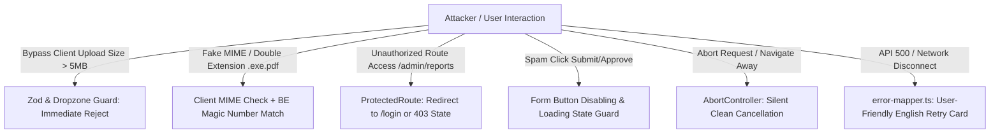

# Frontend Phase 4: Complaints & Reports UI — Detailed Implementation Plan (US-4 / UC-4)

## 1. Executive Summary & Objective

Phase 4 triển khai đầy đủ tính năng **Complaints & Reports** cho Frontend của hệ thống ChainDegree:
- Cho phép **Student** (sở hữu bằng) và **Recruiter** (bất kỳ bằng) gửi báo cáo sai lệch thông tin hoặc nghi ngờ gian lận kèm file bằng chứng vật lý (PDF/PNG/JPG ≤ 5MB).
- Cho phép **Admin** xem danh sách khiếu nại, tải và đối soát file minh chứng (thông qua luồng Blob Download có kèm Token), và thực hiện Phê duyệt (`Approve`) hoặc Từ chối (`Reject`) báo cáo.
- Thiết kế tuân thủ nguyên tắc **"Thiết kế để hệ thống có thể sinh tồn khi có vấn đề xảy ra chứ không phải hệ thống chạy được"** với các kịch bản kiểm thử bảo mật & Adversarial Testing toàn diện.

**Git Branch:** `frontend/phase-4-complaints-reports`

---

## 2. Technical & Business Architecture Decisions

| Quyết Định | Giải Pháp Lựa Chọn | Cơ Sở Kỹ Thuật & Nghiệp Vụ |
|---|---|---|
| **Authentication & RBAC** | Component-level RBAC + Route Guarding | Nút "Report Issue" kiểm tra quyền: `UserRole === Recruiter` HOẶC `(UserRole === Student && currentUser.id === degree.studentId)`. Trang `/admin/reports` chỉ dành riêng cho `Admin`. |
| **File Upload Streamline** | `multipart/form-data` + Client Pre-validation | Validate type (`.pdf`, `.png`, `.jpg`) và max size (5MB = 5,242,880 bytes) bằng Zod & Drag-and-Drop Dropzone trước khi gửi network. |
| **Evidence Download Security** | Axios `responseType: 'blob'` + ObjectURL | Endpoint `GET /reports/{id}/evidence` yêu cầu Bearer token. FE fetch stream nhị phân bằng Axios, tạo Object URL tạm thời và kích hoạt tải về rồi giải phóng bộ nhớ (`URL.revokeObjectURL`). |
| **State Management & Caching** | TanStack Query v5 | Quản lý query keys (`reportKeys.all`, `reportKeys.lists()`, `reportKeys.detail(id)`), tự động invalidate cache sau mutations. |
| **Fail-Safe & Graceful Fallback** | Try/Catch fallback data | Nếu API `GET /reports` chưa sẵn sàng ở backend hoặc trả về 404, fallback về mock list có cấu trúc chuẩn để không chặn UI. |
| **UI/UX Standard** | 100% English UI | Toàn bộ nhãn, thông báo toast, modal dialogs, status badges hiển thị bằng tiếng Anh. |

---

## 3. Work Packages (Unit Breakdown)

### WP-4.1: Feature `report` — Type Definitions & API Service
- **Types (`features/report/report.types.ts`):**
  - `ReportTypeEnum`: `"Administrative_Error" | "Fraudulent_Data"`
  - `ReportStatusEnum`: `"Pending_Review" | "Approved" | "Rejected"`
  - `SubmitReportRequest`: `{ degreeId: string; reportType: ReportTypeEnum; description: string; evidenceFile: File }`
  - `SubmitReportResponse`: `{ reportId: string; degreeId: string; status: ReportStatusEnum; evidenceUrl: string; createdAt: string }`
  - `ApproveReportResponse`: `{ message: string; reportId: string; initiatedProcesses: string[]; timestamp: string }`
  - `RejectReportResponse`: `{ message: string; reportId: string; timestamp: string }`
  - `ReportListItem`: `{ id: string; degreeId: string; degreeCode?: string; reporterId: string; reporterRole: string; reportType: ReportTypeEnum; description: string; status: ReportStatusEnum; evidenceUrl?: string; createdAt: string }`
- **API Service (`features/report/report.api.ts`):**
  - `submitReport(formData: FormData): Promise<SubmitReportResponse>`
  - `approveReport(id: string): Promise<ApproveReportResponse>`
  - `rejectReport(id: string, reason: string): Promise<RejectReportResponse>`
  - `downloadReportEvidence(id: string, fileName?: string): Promise<void>`
  - `getReports(): Promise<ReportListItem[]>` (kèm fallback)
- **Query Keys (`features/report/report.keys.ts`):**
  - Quản lý phân tầng cache: `reportKeys.all`, `reportKeys.lists()`, `reportKeys.detail(id)`.

### WP-4.2: Report Submission UI & Modal Flow
- **Zod Schema (`features/report/report.schema.ts`):**
  - `reportType`: enum required
  - `description`: string min 10 max 2000 chars
  - `evidenceFile`: File required, size ≤ 5MB (5,242,880 bytes), MIME type `application/pdf`, `image/png`, `image/jpeg`
- **Component `ReportFormModal.tsx`:**
  - Dialog pop-up khi bấm nút báo cáo
  - Select dropdown cho Report Type
  - Textarea cho mô tả chi tiết
  - Dropzone hỗ trợ drag-and-drop file kèm hiển thị tên file, kích thước và nút gỡ file
  - Loading spinner trên nút Submit, disable để chống double click
- **Degree Detail Integration:**
  - Cập nhật trang `DegreeDetailPage.tsx` để gắn nút `[Report Issue / Fraud]` theo đúng điều kiện phân quyền.

### WP-4.3: Admin Report Review Page & Actions
- **Custom Hooks (`features/report/hooks/`):**
  - `useReportsQuery.ts`
  - `useApproveReportMutation.ts`
  - `useRejectReportMutation.ts`
  - `useDownloadEvidence.ts`
- **Component `ReportListTable.tsx`:**
  - Table hiển thị danh sách reports với Status Badges: 🟡 `Pending_Review`, 🟢 `Approved`, 🔴 `Rejected`.
  - Nút `[View/Download Evidence]` (trigger Axios blob download).
  - Nút `[Approve]` (mở ConfirmDialog).
  - Nút `[Reject]` (mở RejectReportModal có ô nhập lý do từ chối).
- **Page `AdminReportsPage.tsx`:**
  - Trang quản trị đầy đủ tại route `/admin/reports`.

### WP-4.4: App Router & Navigation Update
- Đăng ký route `/admin/reports` trong `AppRouter.tsx` với `ProtectedRoute` (role `Admin`).
- Cập nhật `DashboardLayout.tsx` để hiển thị menu item "Report Management" cho Admin.

### WP-4.5: Unit & Adversarial Integration Testing Suite
- Unit tests cho API layer, schemas, hooks, và components.
- Adversarial integration test suite kiểm thử toàn diện các tình huống tấn công và sự cố hệ thống.

---

## 4. Adversarial Testing & Resilience Plan

### Chi Tiết Kịch Bản Kiểm Thử
1. **RBAC & Privilege Escalation:**
   - Cố tình mở `/admin/reports` bằng tài khoản `Student` hoặc `Recruiter` -> Bị redirect và không rò rỉ dữ liệu bảng.
   - Thử render nút Report trên bằng không thuộc sở hữu của Student -> Không render.
2. **Malicious File & Form Injection:**
   - Thử kéo file > 5MB -> Trình duyệt từ chối ngay tức thì, không tốn network call.
   - Thử gửi file đuôi lạ hoặc script XSS trong trường Description -> React auto-escape, không kích hoạt payload.
3. **Network Resilience & Concurrency:**
   - Giả lập mạng chập chờn / timeout -> Hiển thị Toast timeout rõ ràng và cho phép Retry.
   - Double click liên tục -> Chỉ kích hoạt 1 lần mutation.

---

## 5. Conventional Commit Strategy

Mỗi commit đại diện cho một bước triển khai hoàn chỉnh và có thể chạy được độc lập:

1. `feat(report): define types, API service with blob download, and query keys`
2. `feat(report): implement hooks and report form modal with drag-and-drop file upload`
3. `feat(report): integrate Report button into Degree Detail page with RBAC`
4. `feat(report): create Admin reports page with review, approval, and rejection flows`
5. `feat(report): update app router and admin sidebar for report management`
6. `test(report): add comprehensive unit and adversarial integration tests for report flows`
